# Deploying game application on EKS cluster

Prerequisites: Install kubectl, eksctl and aws cli and configure it on your system.

## Install EKS using Fargate

```
eksctl create cluster --name demo-cluster --region eu-central-1 --fargate
```

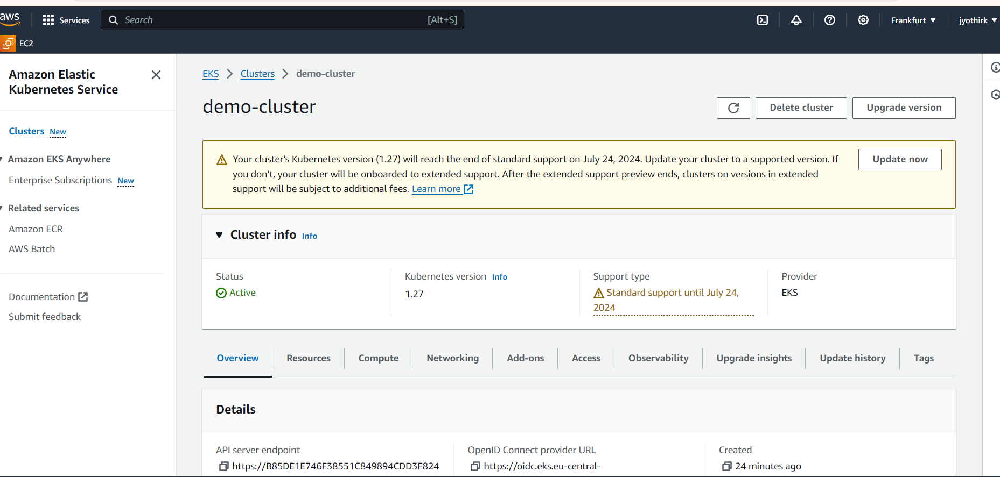

Update eks kubeconfig 
```
aws eks update-kubeconfig --name demo-cluster --region eu-central-1
```
## Create Fargate profile in name space game-2048

eksctl create fargateprofile \
    --cluster demo-cluster \
    --region eu-central-1 \
    --name alb-sample-app \
    --namespace game-2048

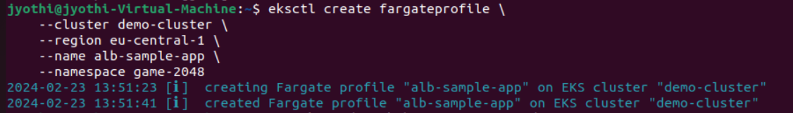

## Deploy the deployment, service and Ingress
```
kubectl apply -f manifests.yaml
```

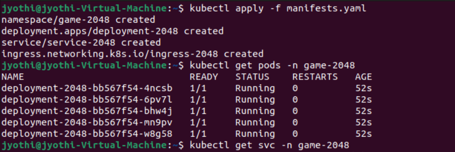


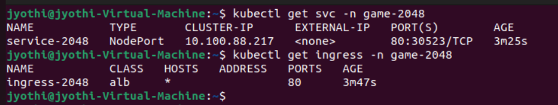

## Configure IAM OIDC provider
```
eksctl utils associate-iam-oidc-provider --cluster demo-cluster --approve
```
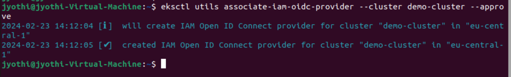

## How to setup alb add on

Download IAM policy

```
curl -O https://raw.githubusercontent.com/kubernetes-sigs/aws-load-balancer-controller/v2.5.4/docs/install/iam_policy.json
```

Create IAM Policy

```
aws iam create-policy \
    --policy-name AWSLoadBalancerControllerIAMPolicy \
    --policy-document file://iam_policy.json
```

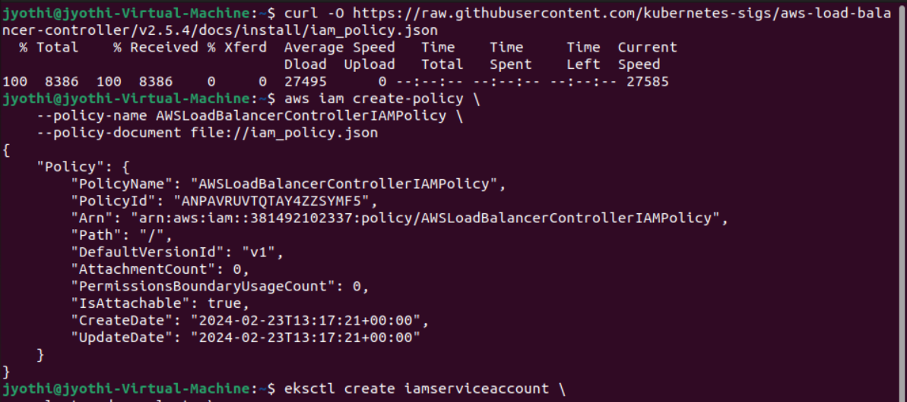

Create service account and IAM Role

```
eksctl create iamserviceaccount \
  --cluster=demo-cluster \
  --namespace=kube-system \
  --name=aws-load-balancer-controller \
  --role-name AmazonEKSLoadBalancerControllerRole \
  --attach-policy-arn=arn:aws:iam::<your-aws-account-id>:policy/AWSLoadBalancerControllerIAMPolicy \
  --approve
```

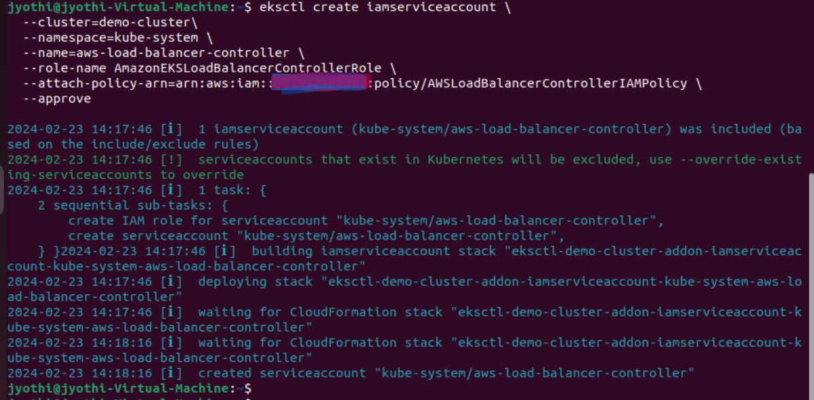


## Deploy ALB controller

Add helm repo

```
helm repo add eks https://aws.github.io/eks-charts
```

Update the repo

```
helm repo update eks
```

Install

```
helm install aws-load-balancer-controller eks/aws-load-balancer-controller \            
  -n kube-system \
  --set clusterName=demo-cluster \
  --set serviceAccount.create=false \
  --set serviceAccount.name=aws-load-balancer-controller \
  --set region=eu-central-1 \
  --set vpcId=vpc-0b031ee8ca5d57d1b
```

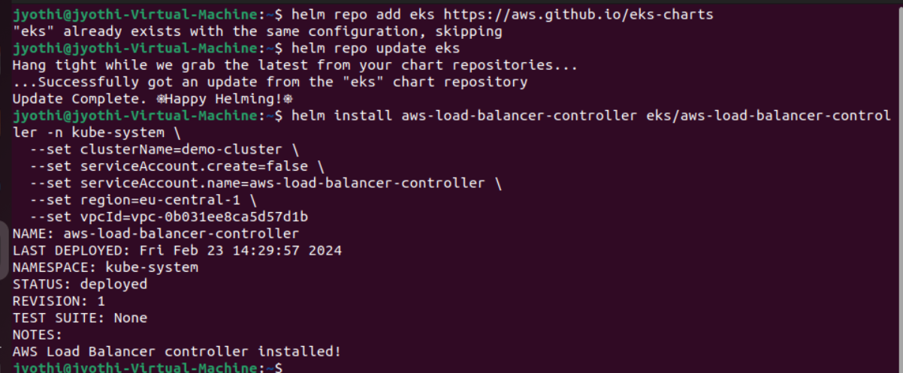

Verify that the deployments are running.

```
kubectl get deployment -n kube-system aws-load-balancer-controller
```

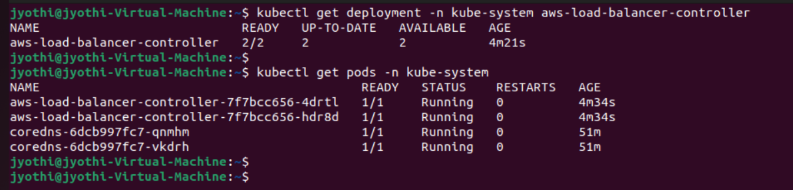

Now check the Ingress, it should be updated with address & this adress should be same as ALB DNS

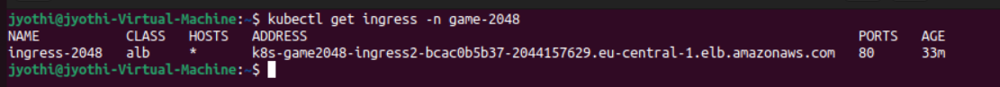

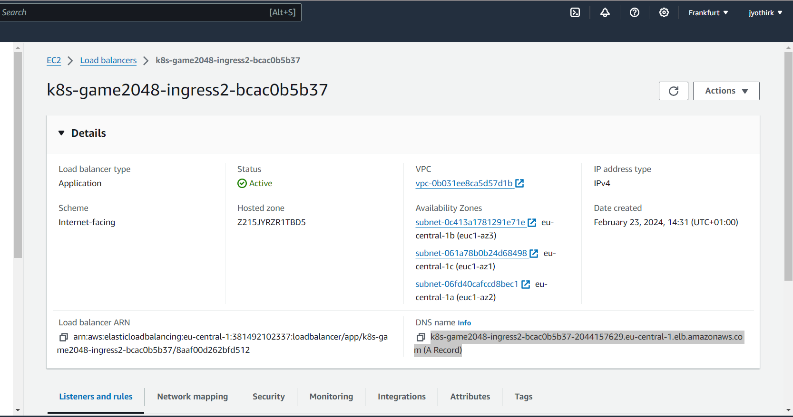

Now open the address on the browser


